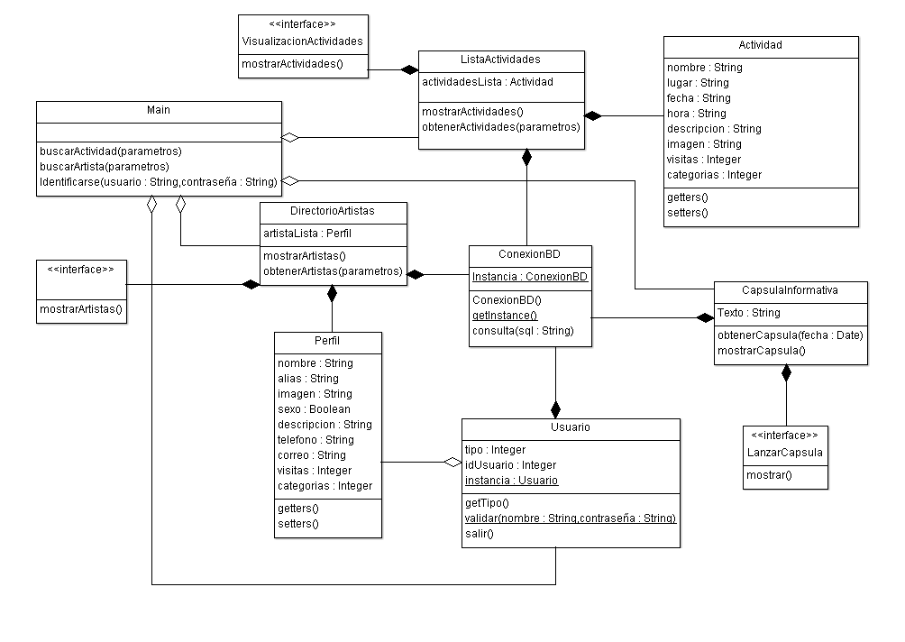
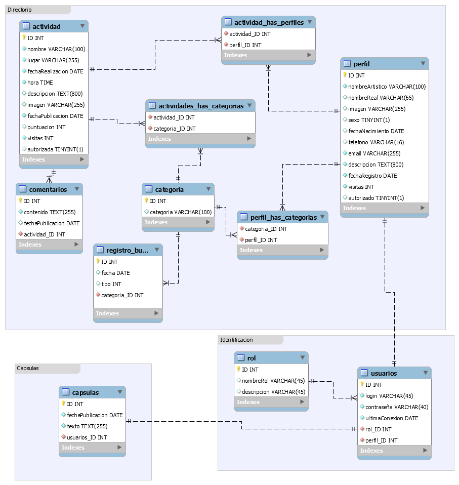

Diseño de la aplicacíon
=======================

Casos de Uso
------------

 .. _ref_vistaGeneral:

Vista General
*************

  .. figure:: diagramaCasosdeUso/vistaGeneral.png
   :align:  center

 .. _ref_actividades:

Actividades
***********

  .. figure:: diagramaCasosdeUso/actividades.png
   :align:  center

 .. _ref_artistas:

Artistas
********

  .. figure:: diagramaCasosdeUso/artistas.png
   :align:  center

 .. _ref_capsulas:

Capsulas Informativas
*********************

  .. figure:: diagramaCasosdeUso/capsulas.png
   :align:  center

 .. _ref_adminArtEven:

Administracion de Artistas y Eventos
************************************

  .. figure:: diagramaCasosdeUso/administrarArtistas-Eventos.png
   :align:  center

 .. _ref_cuentas:

Administracion de Cuentas
*************************

  .. figure:: diagramaCasosdeUso/administrarCuentas.png
   :align:  center

 .. _ref_estadisticas:

Estadisticas de Uso
*******************

  .. figure:: diagramaCasosdeUso/estadisticas.png
   :align:  center

Clases
------

Diagrama de BD
--------------

