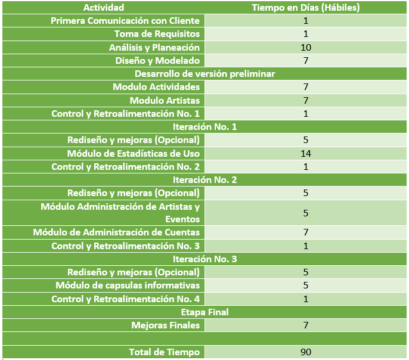

Desarrollo del proyecto
=======================

Cómo se trabajará
-----------------

La aplicación será construida utilizando un modelo de desarrollo iterativo,
el modelo iterativo divide el proyecto en distintos bloques de avance cada uno
llamado iteración, en cada iteración se agregan características a la aplicación
de forma planeada, al final de cada una el cliente puede evaluar las funcionalidades
ya completados, sugerir mejoras o expresar inconformidades, que se tomaran en cuenta
para la siguiente iteración.

Que ventajas ofrece:

 * Como cliente no tendrá que esperar hasta el final del desarrollo para tener un contacto directo con la aplicación
 * Se pueden aplicar mejoras o cambios sin retrasar de forma excesiva el desarrollo
 * Las entregas son consistentes y puntuales

Actividades a realizar
----------------------

Las actividades a realizar son

* Etapa de inicialización

  * Primera Comunicación
  * Toma de requisitos
  * Análisis y planeación de la aplicación
  * Diseño y modelado de la aplicación
  * Desarrollo de la versión de la aplicación preliminar
  * Primera etapa de control y retroalimentación con cliente

  Como consecuencia del modelo siendo utilizado esta primera etapa es la más tardada

* Iteración

  * Rediseño(de ser necesario) en base a la retroalimentación con el cliente
  * Implementación de los siguientes módulos y características planeados

* Control y retroalimentación

  * Etapa de control y retroalimentación con cliente
  * Vuelta a la etapa de iteración hasta que la aplicación este completa al 100%

* Entrega final

Los detalles mas específicos de cada iteración se especifican
en la sección :ref:`ref_tiempo`

Entregables
-----------

* Aplicación compilada y lista para ejecutar
  La aplicación compilada con todos sus módulos, lista para ser publicada y descargada
  por los usuarios finales

* Código fuente y su documentación técnica
  El código fuente de la aplicación, junto a su documentación especifica para que en un
  futuro pueda ser modificada, ya sea por este mismo equipo o por uno ajeno.

* Análisis y explicación del proyecto:
  El documento que esta leyendo

* Manual de usuario
  Una manual que describe más específicamente y paso a paso todas las acciones que puede
  realizar un usuario común.

* Manual de administrador
  Un manual que describe detalladamente todas las acciones que puede realizar el administrador,
  el paso a paso, las consideraciones, advertencias y condiciones para cada acción.

 .. _ref_tiempo:

Tabla de tiempos
----------------

Condiciones
-----------

* Para que la aplicación pueda ser publicada en tiendas de aplicaciones online (Google Play Store, Apple Store)
  es necesario contar con cuentas autorizadas en cada tienda, cuyos costos correrán a cargo del cliente.

* Los servicios y costos de host para la aplicación corren a cuenta del cliente.
